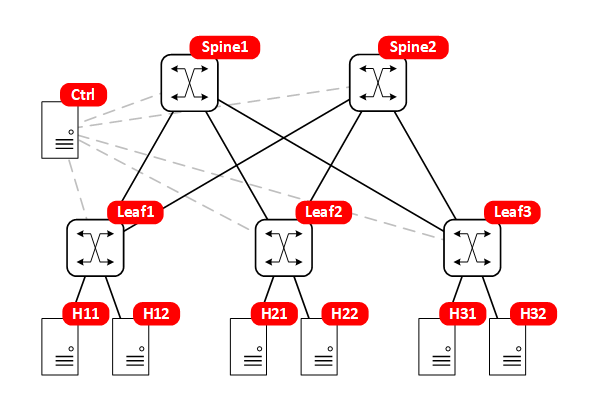
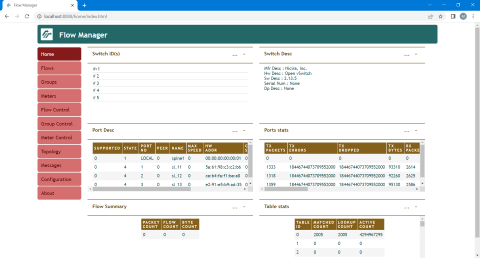
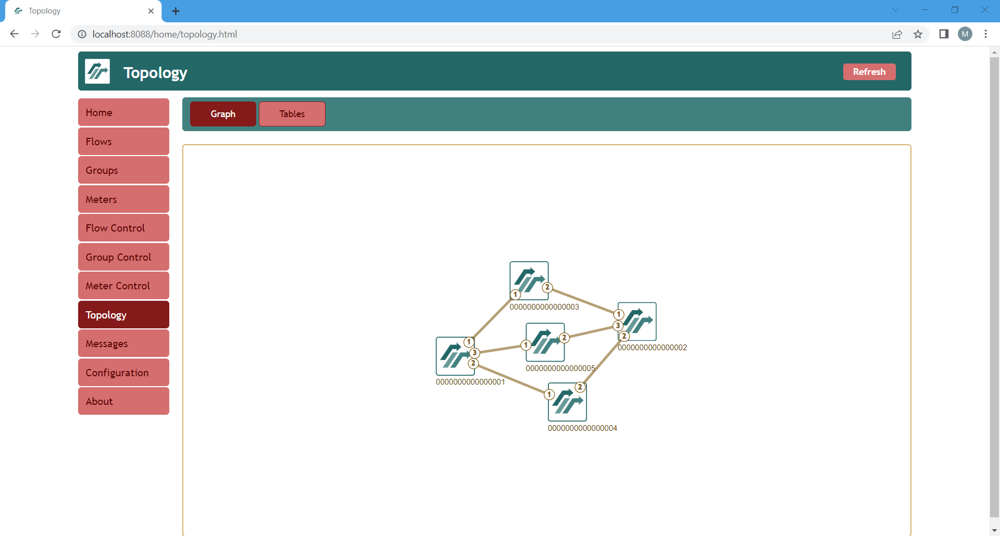

# Software Defined Data Centre lab

This lab creates a software-defined data centre network using spine-leaf architecture built with Open-vSwitch switches.



## Requirements

To use this lab, you need to install containerlab. You also need to have basic familiarity with Docker.

This lab uses the following Docker images (they will be pulled automatically when you start the lab):

- martimy/ryu-flowmanager:latest — includes a [Ryu](https://github.com/faucetsdn/ryu) controller and [FlowManager](https://github.com/martimy/flowmanager).
- wbitt/network-multitool:alpine-minimal — a Linux with simple tools


## How does it work?

This lab builds an SDN network using [Open vSwitch](https://www.openvswitch.org/) (OVS) and [Docker](https://www.docker.com/) containers. These components are "glued" together using [containerlab](https://containerlab.dev/).

The Open vSwitch is an open-source virtual switch that is included in many Linux distribution. OVS is designed to work as a standalone switch that supports many standard management interfaces and protocols. OVS can also work as an SDN switch supporting OpenFlow protocol.

As an OpenFlow switch, on OVS needs an SDN controller. In this lab, the SDN controller used is [Ryu](https://ryu-sdn.org/). Ryu is installed in a Docker image along with FlowManager app, which provides a GUI access to the switches.

To emulate hosts in the data center, the lab includes a Docker image with pre-installed tools for testing.

Containerlab provides mechanisms to start Docker containers, build virtual topologies, and managing their lifecycle. A lab structure is provided in a YAML file that includes the containers to be deployed and their connections. However, containerlab, cannot create bridges (standard or OVS) other than the management bridge. Therefore, the bridges in this lab must be created externally using a shell script before deploy the containerlab topology. Also, another shell script is required to delete all bridges at the end of the lab.


## Starting and ending the lab

You must create the switches first, then deploy the lab:

```
sudo ./setup-dc.sh
sudo clab deploy -t sdn-dcn.clab.yml
```

Run Ryu controller with any number of apps. This example shows how to start the FlowManager app that allows you to populate the flow tables manually.

```
docker exec clab-sdn-dcn-ctrl ryu-manager flowmanager/flowmanager.py --verbose
```

To end the lab

```
sudo clab destroy -t sdn-dcn.clab.yml --cleanup
sudo ./reset-dc.sh
```

## Try this

After starting the lab as above, start the Ryu controller and the FlowManager:

```
$ docker exec -d clab-sdn-dcn-ctrl ryu-manager flowmanager/flowmanager.py --observe-links
```

Confirm that all switches are connected to the controller:

```
$ sudo ovs-vsctl show
6324bfc8-4c27-4eb1-852d-bc560406943e
    Bridge leaf1
        Controller "tcp:172.10.10.10:6653"
            is_connected: true

<remaining output omitted>
```

To access the FlowManager GUI, direct your browser to http://localhost:8080/home/ from your host machine. If the host does not have a desktop or if you want to access it remotely use:

```
ssh -L 8080:172.10.10.10:8080 -p 2222 user@remotehost
```

Replace user@remotehost with the username and address of your host machine.

The --observe-links used above, allows the controller to discover the topology using LLDP. The FlowManager manager will show the topology as in the next figure:




To stop the controller:

```
$ docker exec clab-sdn-dcn-ctrl killall ryu-manager
```


Note that you need to run an app to populate the switch flow tables or do it manually using FlowManager. In any case, you should be able to ping from one host to another using the following commands:

```
$ docker exec -it clab-sdn-dcn-h11 ping 192.168.11.3
PING 192.168.11.3 (192.168.11.3) 56(84) bytes of data.
64 bytes from 192.168.11.3: icmp_seq=1 ttl=64 time=0.419 ms
64 bytes from 192.168.11.3: icmp_seq=2 ttl=64 time=0.094 ms
64 bytes from 192.168.11.3: icmp_seq=3 ttl=64 time=0.105 ms
64 bytes from 192.168.11.3: icmp_seq=4 ttl=64 time=0.087 ms
64 bytes from 192.168.11.3: icmp_seq=5 ttl=64 time=0.097 ms
^C
--- 192.168.11.3 ping statistics ---
5 packets transmitted, 5 received, 0% packet loss, time 4090ms
rtt min/avg/max/mdev = 0.087/0.160/0.419/0.129 ms
```
